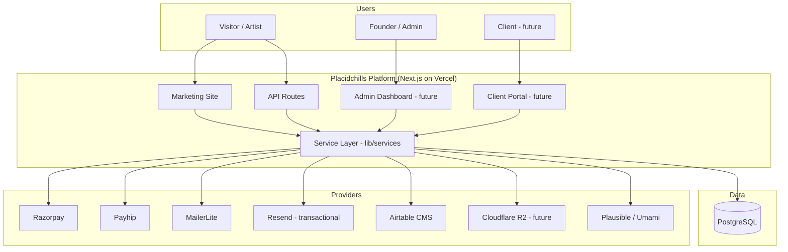
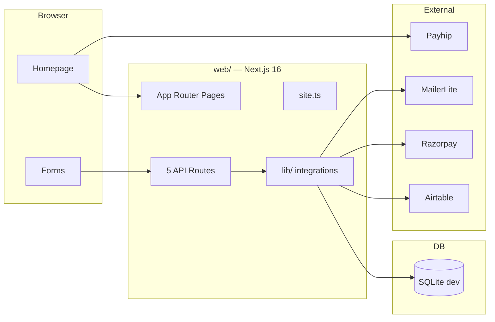
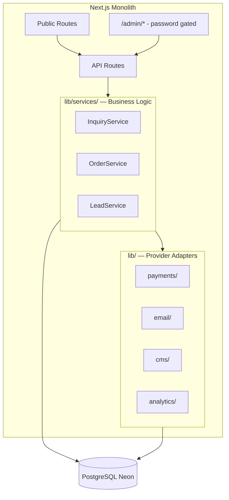
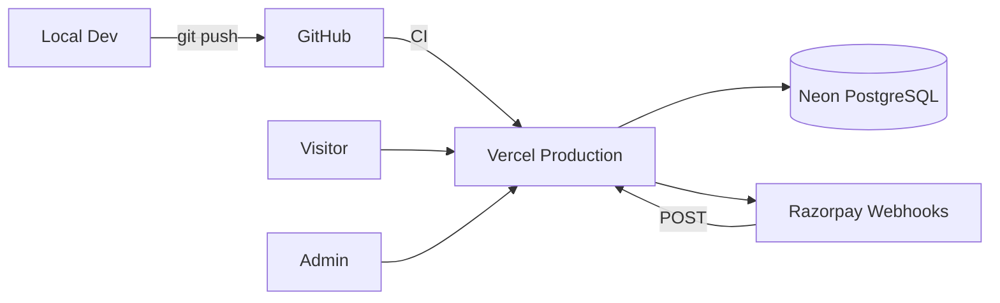

# System Architecture

> **Status:** Living document · Last updated: 2026-06-26

---

## Architecture Overview

Placidchills uses a **Next.js monolith** pattern: a single deployable application handles marketing pages, API routes, and (future) admin UI. External services are accessed through provider adapters in `web/src/lib/`.

This architecture is stable for MVP through V2. Microservices are explicitly deferred.

---

## System Context Diagram



---

## Current Architecture (As-Built)



### API Routes (Current)

| Route | Method | Purpose | Status |
|-------|--------|---------|--------|
| `/api/inquiries` | POST | Save inquiry + send emails | Active |
| `/api/newsletter` | POST | Save lead + MailerLite sync | Active |
| `/api/beats` | GET | Beat catalogue JSON | Active — unused by frontend |
| `/api/payments/razorpay` | POST | Create Razorpay order | Active — no UI consumer |
| `/api/webhooks/razorpay` | POST | Payment capture webhook | Active — minimal handling |

### Pages (Current)

| Route | Type | Purpose |
|-------|------|---------|
| `/` | SSR | Marketing homepage |
| `/licensing` | Static | License terms |
| `/terms-of-service` | Static | Terms |
| `/privacy-policy` | Static | Privacy |
| `/refund-policy` | Static | Refunds |
| `/disclaimer` | Static | Disclaimer |

---

## Target Architecture (MVP)



### Target Directory Structure

```
web/src/
├── app/
│   ├── (site)/              # Public marketing
│   ├── admin/               # Admin dashboard (V1)
│   ├── portal/              # Client portal (V2)
│   └── api/
│       ├── inquiries/
│       ├── newsletter/
│       ├── payments/
│       ├── webhooks/
│       └── admin/           # Protected admin APIs
├── components/
│   ├── home/
│   ├── forms/
│   ├── layout/
│   ├── admin/               # Future
│   └── ui/
├── config/
│   └── site.ts
├── lib/
│   ├── prisma.ts
│   ├── payments/
│   │   ├── types.ts         # PaymentProvider interface
│   │   ├── razorpay.ts
│   │   └── index.ts
│   ├── email/
│   │   ├── types.ts         # EmailProvider interface
│   │   ├── mailerlite.ts    # Marketing
│   │   ├── resend.ts        # Transactional
│   │   └── index.ts
│   ├── cms/
│   │   ├── types.ts
│   │   ├── airtable.ts
│   │   └── index.ts
│   ├── analytics/
│   │   ├── types.ts
│   │   ├── plausible.ts
│   │   └── index.ts
│   ├── services/
│   │   ├── inquiry.service.ts
│   │   ├── order.service.ts
│   │   └── lead.service.ts
│   └── beats.ts             # Migrate to cms/ adapter
└── styles/
```

---

## Deployment Architecture



| Environment | Hosting | Database | Branch |
|-------------|---------|----------|--------|
| Development | localhost:3000 | SQLite (`dev.db`) | any |
| Preview | Vercel Preview | Neon branch (future) | PR branches |
| Production | Vercel | Neon PostgreSQL | `main` |

---

## Data Flow: Critical Paths

### Inquiry Flow (Target MVP)

```
Form submit → POST /api/inquiries
  → Zod validation
  → InquiryService.create()
    → prisma.inquiry.create()
    → EmailService.sendInquiryConfirmation(client)
    → EmailService.sendAdminNotification(founder)
  → 200 OK
```

### Mastering Payment Flow (Target MVP)

```
Checkout click → POST /api/payments/razorpay
  → Zod validation
  → OrderService.createPending()
    → Razorpay.orders.create()
    → prisma.order.create(status: created)
  → Return orderId + keyId
  → Razorpay Checkout modal (client)
  → Payment success (client callback)
  → POST /api/webhooks/razorpay (async)
    → Verify HMAC signature
    → Check idempotency (PaymentEvent table)
    → Verify amount matches order
    → prisma.order.update(status: paid)
    → EmailService.sendPaymentConfirmation()
    → EmailService.sendAdminNotification()
```

### Newsletter Flow (Current → Target)

```
Email submit → POST /api/newsletter
  → Zod validation
  → LeadService.upsert()
  → MailerLiteProvider.subscribe()
  → [Target] Trigger free-beat automation in MailerLite
  → 200 OK
```

---

## Integration Boundaries

| Provider | Role | System of Record | Replace With |
|----------|------|------------------|--------------|
| PostgreSQL | Business data | **Us** | — |
| Razorpay | Mastering payments | Razorpay + our Order table | Stripe |
| Payhip | Beat checkout + delivery | Payhip | Native checkout (V2+) |
| MailerLite | Marketing email list | MailerLite + our Lead table | ConvertKit, Buttondown |
| Resend (target) | Transactional email | Our EmailQueue table | Postmark, SES |
| Airtable | Beat CMS | Airtable | Admin CMS (V1+) |
| Plausible (target) | Analytics | Plausible | Umami, self-hosted |
| Cloudflare R2 (target) | File storage | R2 | S3, Backblaze B2 |

---

## Scalability Path

| Scale | Architecture change |
|-------|---------------------|
| 0–100 customers | Current monolith + Neon free + Vercel hobby |
| 100–1,000 | Connection pooling (Neon pooler), rate limiting (Upstash) |
| 1,000–10,000 | ISR for beats, R2 for files, email queue |
| 10,000+ | Evaluate admin extraction, read replicas, CDN for audio |

No architectural change required before ~1,000 customers.

---

## Non-Functional Requirements

| Requirement | Target |
|-------------|--------|
| Availability | 99.9% (Vercel SLA) |
| API response time | < 500ms p95 |
| Payment webhook processing | < 2s |
| Database backups | Neon automatic daily |
| Error visibility | Sentry (V1) |
| Secrets management | Vercel env vars |

---

## Related Documents

- [03_DATABASE_DESIGN.md](./03_DATABASE_DESIGN.md)
- [04_SECURITY_GUIDELINES.md](./04_SECURITY_GUIDELINES.md)
- [13_ARCHITECTURE_DECISIONS.md](./13_ARCHITECTURE_DECISIONS.md)
