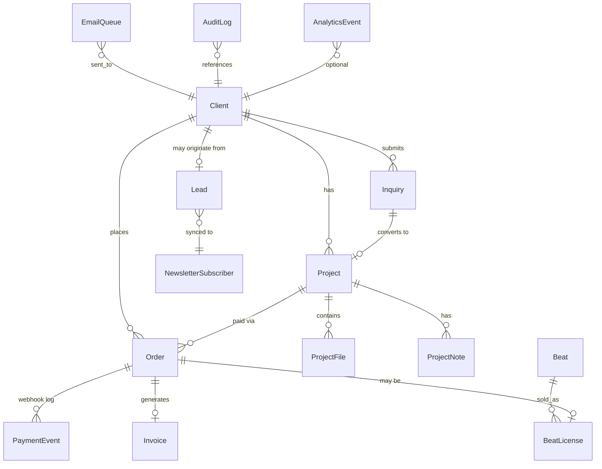

# Database Design

> **Status:** Living document · Last updated: 2026-06-26

---

## Overview

Placidchills uses **Prisma ORM** with **SQLite in development** and **PostgreSQL in production** (Neon free tier).

The database is the **system of record** for all business entities. External services (Payhip, MailerLite) are synchronized but not authoritative.

---

## Current Schema (Implemented)

```prisma
// web/prisma/schema.prisma — as of 2026-06-26

model Lead {
  id        String   @id @default(cuid())
  email     String   @unique
  source    String   @default("newsletter")
  createdAt DateTime @default(now())
}

model Inquiry {
  id        String   @id @default(cuid())
  name      String
  email     String
  service   String
  message   String
  status    String   @default("new")
  createdAt DateTime @default(now())
}

model Order {
  id            String   @id @default(cuid())
  razorpayId    String?  @unique
  amount        Int      // in paise (INR × 100)
  currency      String   @default("INR")
  product       String
  productMeta   String?
  customerEmail String
  customerName  String?
  status        String   @default("pending")
  createdAt     DateTime @default(now())
  updatedAt     DateTime @updatedAt
}
```

### Current Issues

| Issue | Severity | Fix Phase |
|-------|----------|-----------|
| `status` fields are free strings | Medium | MVP — add enums |
| Order default `"pending"` but code uses `"created"` | Low | Sprint 0 |
| No indexes beyond unique constraints | Medium | MVP |
| SQLite provider hardcoded | High | Sprint 0 (prod) |
| No Client model | Medium | V1 |
| No webhook audit log | High | Sprint 1 |

---

## Entity Relationship Diagram (Target)



---

## Target Schema by Phase

### MVP Additions

```prisma
enum InquiryStatus {
  NEW
  CONTACTED
  NEGOTIATING
  PAID
  IN_PRODUCTION
  MASTERING
  REVISION
  DELIVERED
  COMPLETED
  CANCELLED
}

enum OrderStatus {
  CREATED
  PENDING
  PAID
  FAILED
  REFUNDED
  CANCELLED
}

model PaymentEvent {
  id          String   @id @default(cuid())
  orderId     String
  order       Order    @relation(fields: [orderId], references: [id])
  provider    String   @default("razorpay")
  eventType   String
  eventId     String   @unique  // idempotency key
  payload     String   // raw JSON
  processedAt DateTime @default(now())

  @@index([orderId])
}

// Update Inquiry.status → InquiryStatus enum
// Update Order.status → OrderStatus enum
```

### V1 Additions

```prisma
model Client {
  id        String   @id @default(cuid())
  email     String   @unique
  name      String?
  phone     String?
  tags      String[] // or separate Tag model
  notes     String?
  leadId    String?  @unique
  lead      Lead?    @relation(fields: [leadId], references: [id])
  createdAt DateTime @default(now())
  updatedAt DateTime @updatedAt

  inquiries Inquiry[]
  orders    Order[]
  projects  Project[]
}

model Project {
  id          String        @id @default(cuid())
  clientId    String
  client      Client        @relation(fields: [clientId], references: [id])
  inquiryId   String?       @unique
  inquiry     Inquiry?      @relation(fields: [inquiryId], references: [id])
  service     String
  status      InquiryStatus @default(NEW)
  title       String?
  description String?
  dueDate     DateTime?
  createdAt   DateTime      @default(now())
  updatedAt   DateTime      @updatedAt

  files ProjectFile[]
  notes ProjectNote[]
  orders Order[]
}

model ProjectFile {
  id        String   @id @default(cuid())
  projectId String
  project   Project  @relation(fields: [projectId], references: [id])
  name      String
  url       String
  type      String   // stem, master, reference, other
  uploadedBy String  // client, admin
  createdAt DateTime @default(now())
}

model ProjectNote {
  id        String   @id @default(cuid())
  projectId String
  project   Project  @relation(fields: [projectId], references: [id])
  content   String
  createdAt DateTime @default(now())
}

model EmailQueue {
  id        String   @id @default(cuid())
  to        String
  subject   String
  template  String
  payload   String   // JSON
  status    String   @default("pending") // pending, sent, failed
  sentAt    DateTime?
  error     String?
  createdAt DateTime @default(now())

  @@index([status])
}
```

### V2 Additions

```prisma
model User {
  id        String   @id @default(cuid())
  email     String   @unique
  name      String?
  role      UserRole @default(CLIENT)
  clientId  String?  @unique
  client    Client?  @relation(fields: [clientId], references: [id])
  createdAt DateTime @default(now())
}

enum UserRole {
  ADMIN
  CLIENT
}

model Beat {
  id          String   @id @default(cuid())
  externalId  String?  @unique  // Airtable record ID
  name        String
  genre       String
  bpm         String
  key         String
  gradient    String
  previewUrl  String?
  mp3Price    Int
  wavPrice    Int
  stemsPrice  Int
  payhipMp3   String?
  payhipWav   String?
  payhipStems String?
  status      String   @default("published")
  createdAt   DateTime @default(now())
  updatedAt   DateTime @updatedAt

  licenses BeatLicense[]
}

model BeatLicense {
  id        String   @id @default(cuid())
  beatId    String
  beat      Beat     @relation(fields: [beatId], references: [id])
  orderId   String?  @unique
  order     Order?   @relation(fields: [orderId], references: [id])
  clientId  String?
  client    Client?  @relation(fields: [clientId], references: [id])
  tier      String   // mp3, wav, stems, exclusive
  createdAt DateTime @default(now())
}

model Invoice {
  id        String   @id @default(cuid())
  orderId   String   @unique
  order     Order    @relation(fields: [orderId], references: [id])
  number    String   @unique
  amount    Int
  pdfUrl    String?
  createdAt DateTime @default(now())
}

model AuditLog {
  id        String   @id @default(cuid())
  action    String
  entity    String
  entityId  String
  actor     String   // admin email or system
  metadata  String?  // JSON
  createdAt DateTime @default(now())

  @@index([entity, entityId])
}

model AnalyticsEvent {
  id        String   @id @default(cuid())
  event     String
  properties String? // JSON
  sessionId String?
  clientId  String?
  createdAt DateTime @default(now())

  @@index([event])
  @@index([createdAt])
}
```

---

## Indexing Strategy

| Table | Index | Reason |
|-------|-------|--------|
| Inquiry | `(status, createdAt)` | Admin pipeline queries |
| Inquiry | `(email)` | Client lookup |
| Order | `(status, createdAt)` | Revenue reporting |
| Order | `(customerEmail)` | Client order history |
| PaymentEvent | `(eventId)` UNIQUE | Webhook idempotency |
| EmailQueue | `(status)` | Job processing |
| AnalyticsEvent | `(event, createdAt)` | Funnel queries |

---

## Migration Strategy

### Dev → Production (Sprint 0)

1. Change `datasource db { provider = "postgresql" }` in schema
2. Set `DATABASE_URL` to Neon connection string in Vercel
3. Run `npx prisma migrate deploy` on production
4. Keep SQLite for local dev (separate provider via env is OK with Prisma)

### Schema Evolution Rules

1. **Never** drop columns in production without a deprecation period
2. **Always** add migrations via `prisma migrate dev`
3. **Prefer** additive changes (new columns with defaults)
4. **Use enums** for status fields — migrate strings with a data migration script
5. **Backfill** Client records from existing Inquiry/Order emails in V1

---

## Data Retention

| Entity | Retention | Reason |
|--------|-----------|--------|
| Lead | Indefinite | Marketing asset |
| Inquiry | Indefinite | CRM history |
| Order | 7 years | Tax/audit compliance (India) |
| PaymentEvent | 7 years | Audit trail |
| AnalyticsEvent | 2 years | Roll up then purge |
| EmailQueue (sent) | 90 days | Debugging |
| AuditLog | Indefinite | Security/compliance |

---

## Backup & Recovery

| Concern | Solution |
|---------|----------|
| Automated backups | Neon daily snapshots (free tier: 7 days) |
| Point-in-time recovery | Neon paid tier (when revenue justifies) |
| Local dev data | Disposable — `dev.db` is gitignored |
| Export | `pg_dump` or Neon console export before major migrations |

---

## Related Documents

- [02_SYSTEM_ARCHITECTURE.md](./02_SYSTEM_ARCHITECTURE.md)
- [04_SECURITY_GUIDELINES.md](./04_SECURITY_GUIDELINES.md)
- [06_PRODUCT_ROADMAP.md](./06_PRODUCT_ROADMAP.md)
