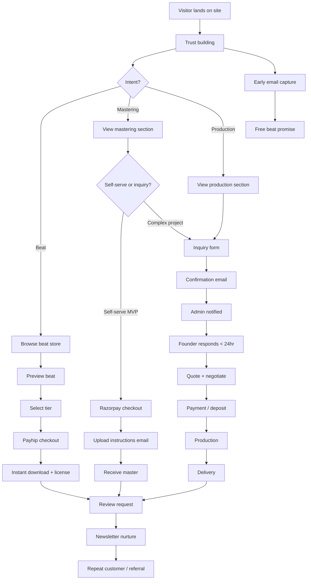

# Customer Journey

> **Status:** Living document · Last updated: 2026-06-26

---

## Journey Overview

Every visitor follows one of three revenue paths. All paths eventually connect to email capture, trust building, and (ideally) repeat business.

---

## Stage Definitions

### 1. Awareness

**Touchpoints:** SEO, social media, referrals, Spotify/YouTube discovery  
**Site role:** Homepage hero, stats, credentials, listen section  
**Goal:** Visitor understands Placidchills is a proven producer, not a hobbyist

| Element | Status | Optimization |
|---------|--------|--------------|
| Hero with stream stats | ✅ Live | — |
| Collab credentials | ✅ Live | Add links to releases |
| Spotify embeds | ✅ Live | Consider lazy-loading |
| SEO landing pages | ❌ Future | `/mastering`, `/production` pages |

---

### 2. Trust Building

**Critical:** Trust must increase before conversion attempt.

| Trust Signal | Status | Priority |
|--------------|--------|----------|
| Stream numbers (10M+) | ✅ Live | — |
| Named credits (GAUSH, etc.) | ✅ Live | — |
| Beat previews | ⚠️ Empty URLs on static beats | **P0** |
| Before/after mastering audio | ❌ Not configured | **P0** |
| Testimonials | ❌ Placeholder text live | **P0 — hide or replace** |
| Legal pages | ✅ Live | — |
| Licensing clarity | ✅ Live | — |

**Rule:** No placeholder content visible to visitors at launch.

---

### 3. Intent Routing

**Touchpoint:** Path selector (beats / mastering / production)

| Path | CTA | Destination | Conversion type |
|------|-----|-------------|-----------------|
| License a Beat | `#beats` | Beat store | Self-serve (Payhip) |
| Get Mastered | `#mastering` | Mastering section | Self-serve (Razorpay) or inquiry |
| Commission Production | `#production` | Production section → `#contact` | Inquiry → manual quote |

**UX bug to fix:** `#contact` anchor currently points to footer, not inquiry form.

---

### 4. Email Capture

**Touchpoint:** Early capture section ("Get a free beat")

| Step | Current | Target |
|------|---------|--------|
| Submit email | ✅ Works | — |
| Save to DB (Lead) | ✅ Works | — |
| Sync to MailerLite | ✅ Works | — |
| Deliver free beat | ❌ Not automated | MailerLite automation with download link |
| Confirmation message | ✅ "Check your inbox" | Must actually deliver |

**Failure mode:** Promising a free beat without delivery destroys trust permanently.

---

### 5. Beat Purchase Journey

| Step | Actor | System | Status |
|------|-------|--------|--------|
| Filter beats by genre | Visitor | BeatStore component | ✅ |
| Preview audio | Visitor | HTML audio element | ⚠️ No preview URLs |
| Select tier (MP3/WAV/Stems) | Visitor | Client-side state | ✅ |
| Click "Buy" | Visitor | Redirect to Payhip | ✅ (links to store homepage currently) |
| Pay on Payhip | Visitor | Payhip | External |
| Download + license | Visitor | Payhip email | External |
| Order recorded in our DB | System | — | ❌ Not tracked |

**Future (V2):** Payhip webhook → unified Order table → admin visibility.

---

### 6. Mastering Journey

| Step | Actor | System | Status |
|------|-------|--------|--------|
| View pricing | Visitor | Mastering section | ✅ |
| Click "Start a request" | Visitor | Links to `#contact` | ❌ Should be Razorpay checkout |
| Pay via Razorpay | Visitor | Razorpay modal | ❌ UI not wired |
| Receive upload instructions | Visitor | Email | ❌ Not implemented |
| Upload mix (Drive/WeTransfer) | Visitor | External | Manual |
| Receive master | Visitor | Drive/email | Manual |
| Payment confirmation | System | Webhook → email | ❌ Partial (webhook only) |

**Target MVP flow:** Pay first → auto-email with upload instructions → manual fulfillment → delivery email.

---

### 7. Custom Production Journey

| Step | Actor | System | Status |
|------|-------|--------|--------|
| Read production section | Visitor | Production component | ✅ |
| Click "Request Production Quote" | Visitor | `#contact` | ⚠️ Anchor bug |
| Fill inquiry form | Visitor | InquiryForm | ✅ |
| Form saved to DB | System | `/api/inquiries` | ✅ |
| Confirmation email to client | System | Email provider | ❌ |
| Admin notification | System | Email to founder | ❌ |
| Founder responds | Founder | Manual (email/DM) | Manual |
| Quote sent | Founder | Manual | Manual |
| Negotiate scope | Both | Manual | Manual |
| Deposit payment | Client | Razorpay (future) or manual | ❌ |
| Production | Founder | DAW | Manual |
| Delivery | Founder | Drive/WeTransfer | Manual |
| Revision round | Both | Manual | Manual |

**Target V1:** Inquiry pipeline in admin with status tracking.

---

### 8. Post-Delivery

| Step | Timing | Channel | Status |
|------|--------|---------|--------|
| Delivery confirmation email | On delivery | Email | ❌ |
| Review request | 3–7 days after delivery | Email | ❌ |
| Newsletter nurture | Ongoing | MailerLite | ⚠️ Partial |
| Seasonal offers | Quarterly | MailerLite campaign | ❌ |
| Re-engagement | 90 days inactive | MailerLite automation | ❌ |

---

### 9. Repeat Customer & Referral

| Trigger | Action | Status |
|---------|--------|--------|
| Previous client visits | Recognize email in CRM | ❌ V1 |
| Previous client inquires | Show history in admin | ❌ V1 |
| Satisfied client | Ask for referral / testimonial | ❌ Manual |
| Newsletter subscriber | New beat drop notification | ❌ MailerLite automation |

---

## Inquiry Pipeline States

Used in admin CRM (V1). Map to `InquiryStatus` enum in [03_DATABASE_DESIGN.md](./03_DATABASE_DESIGN.md).

| Status | Meaning | Next action |
|--------|---------|-------------|
| `NEW` | Just submitted | Respond within 24hr |
| `CONTACTED` | Initial reply sent | Qualify project |
| `NEGOTIATING` | Quote/discussion active | Send quote |
| `PAID` | Payment received | Begin work |
| `IN_PRODUCTION` | Active production | Deliver WIP if applicable |
| `MASTERING` | In mastering phase | Deliver master |
| `REVISION` | Client requested changes | Apply revision |
| `DELIVERED` | Final files sent | Request review |
| `COMPLETED` | Project closed | Nurture for repeat |
| `CANCELLED` | Did not proceed | Archive |

---

## Email Automation Map

| Event | Recipient | Template | Phase |
|-------|-----------|----------|-------|
| Inquiry submitted | Client | Inquiry confirmation | MVP |
| Inquiry submitted | Admin | New inquiry alert | MVP |
| Newsletter signup | Client | Welcome + free beat | MVP |
| Payment captured | Client | Payment confirmation + next steps | MVP |
| Payment captured | Admin | New order alert | MVP |
| Payment failed | Admin | Failed payment alert | Sprint 1 |
| Project accepted | Client | Project kickoff | V1 |
| Files delivered | Client | Delivery notification | V1 |
| Review request | Client | "How was it?" | V1 |
| New beat drop | Subscribers | New release | V1 |
| Seasonal offer | Subscribers | Campaign | V2 |
| Re-engagement | Inactive subs | "We miss you" | V2 |

---

## Analytics Events to Track

Provider-agnostic layer — see [02_SYSTEM_ARCHITECTURE.md](./02_SYSTEM_ARCHITECTURE.md).

| Event | Trigger | Funnel stage |
|-------|---------|--------------|
| `hero_cta_click` | Hero button click | Awareness |
| `path_select` | Path card click | Intent |
| `pricing_view` | Mastering/pricing visible | Consideration |
| `beat_preview` | Beat play button | Consideration |
| `beat_tier_select` | Tier button click | Consideration |
| `beat_purchase_click` | Buy button click | Conversion |
| `inquiry_submit` | Inquiry form success | Conversion |
| `newsletter_signup` | Email capture success | Conversion |
| `checkout_start` | Razorpay modal open | Conversion |
| `payment_success` | Payment confirmed | Revenue |
| `payment_failed` | Payment failed | Drop-off |
| `licensing_page_view` | /licensing visit | Consideration |

---

## Journey Optimization Priorities

| Priority | Journey step | Impact | Effort |
|----------|---------------|--------|--------|
| P0 | Fix `#contact` anchor | All production/mastering CTAs | 5 min |
| P0 | Inquiry confirmation + admin email | Production revenue | 1 day |
| P0 | Hide/replace placeholder testimonials | Trust | 1 hour |
| P0 | Free beat delivery automation | Lead magnet integrity | 2 hours |
| P0 | Razorpay mastering checkout | Mastering revenue | 2 days |
| P1 | Beat preview audio URLs | Beat conversion | 2 hours |
| P1 | Before/after mastering audio | Mastering conversion | 2 hours |
| P1 | Analytics events | Measurement | 1 day |
| P2 | Inquiry pipeline admin | Operations | 3 days |
| P2 | Post-delivery email sequence | Retention | 2 days |

---

## Related Documents

- [01_PRODUCT_VISION.md](./01_PRODUCT_VISION.md)
- [06_PRODUCT_ROADMAP.md](./06_PRODUCT_ROADMAP.md)
- [07_SPRINT_BACKLOG.md](./07_SPRINT_BACKLOG.md)
