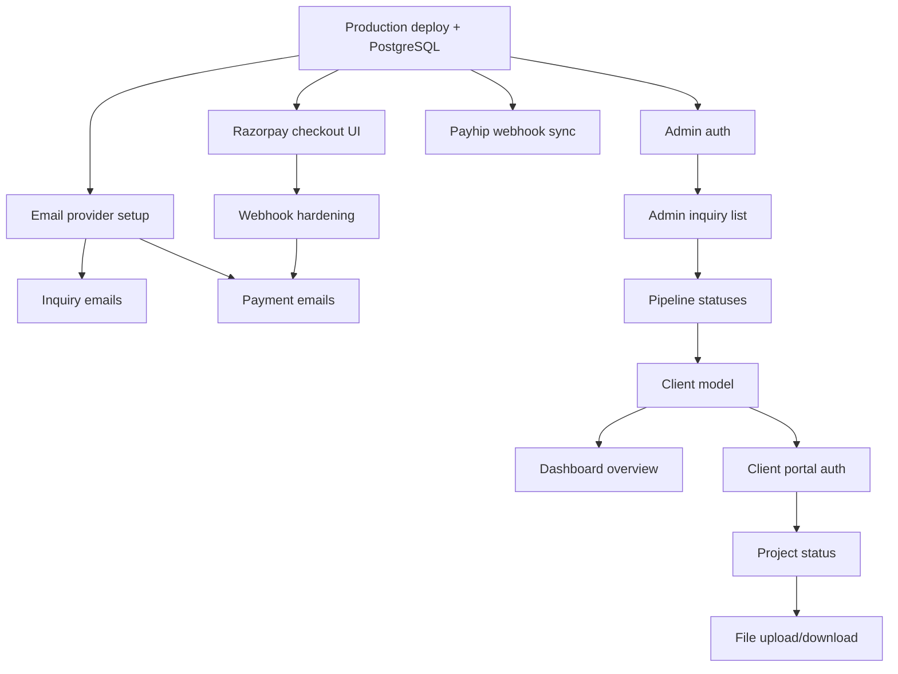

# Product Roadmap

> **Status:** Living document · Last updated: 2026-06-26

---

## Roadmap Phases

| Phase | Timeline | Goal | Success Criteria |
|-------|----------|------|------------------|
| **MVP** | Weeks 1–6 | Launch-ready revenue site | Payments work, emails send, no placeholder content |
| **V1** | Months 2–4 | Business operations dashboard | Admin CRM, pipeline, email automation |
| **V2** | Months 5–12 | Client self-service + unified orders | Portal, file delivery, beat order tracking |
| **Future** | Year 2+ | Full platform | Community, digital products, advanced analytics |

---

## MVP — Launch-Ready Business

**Goal:** A visitor can trust the site, submit an inquiry, pay for mastering, buy a beat, and join the newsletter — with automated confirmations.

### Features

| Feature | Business Value | Complexity | Dependencies | Risks | Effort | Status |
|---------|---------------|------------|--------------|-------|--------|--------|
| Fix `#contact` anchor | Unblocks all CTAs | Low | None | None | 30 min | ✅ |
| Replace/hide testimonials | Trust / conversion | Low | Founder quotes | Fake quotes harm brand | 1 hr | ✅ Hidden |
| PostgreSQL production deploy | Data persistence | Medium | Neon account, Vercel | SQLite in prod | 4 hr | ✅ Config ready |
| Inquiry confirmation email | Professionalism | Medium | Email provider (D-002) | Provider choice | 4 hr | ✅ |
| Admin inquiry notification | Speed-to-lead | Medium | Email provider | Email deliverability | 2 hr | ✅ |
| Rate limiting + honeypot | Security | Medium | Upstash (optional) | Over-blocking real users | 4 hr | ✅ |
| Security headers | Security compliance | Low | next.config.ts | CSP breaking embeds | 1 hr | ✅ |
| Airtable beats + preview URLs | Beat store functional | Medium | Airtable setup, audio files | Missing assets | 4 hr | ❌ |
| Razorpay mastering checkout UI | Direct mastering revenue | High | Razorpay live keys | Payment UX friction | 2 days | ❌ |
| Payment webhook hardening | Payment safety | Medium | PaymentEvent model | Missed webhooks | 1 day | ❌ |
| Payment confirmation emails | Customer trust | Medium | Email provider | — | 4 hr | ❌ |
| Free beat MailerLite automation | Lead magnet works | Medium | Beat file, MailerLite | Broken promise | 2 hr | ❌ |
| Before/after mastering audio | Mastering conversion | Low | Audio files | — | 2 hr | ❌ |
| Analytics (Plausible/Umami) | Funnel measurement | Low | Analytics account | Privacy policy update | 2 hr | ❌ |
| SEO: sitemap, robots, OG image | Discoverability | Low | OG image asset | — | 2 hr | ❌ |
| Font consolidation | Performance | Low | next/font | Visual regression | 2 hr | ❌ |

**MVP explicitly excludes:** Admin dashboard, client portal, custom beat checkout, blog, community.

---

## V1 — Business Operations

**Goal:** Founder can manage inquiries, track orders, and automate the customer lifecycle from admin.

### Features

| Feature | Business Value | Complexity | Dependencies | Risks | Effort |
|---------|---------------|------------|--------------|-------|--------|
| Password-protected admin | Operations foundation | Medium | Auth decision (D-003) | Weak password | 1 day |
| Admin: inquiry list + detail | CRM foundation | Medium | Admin auth | — | 2 days |
| Inquiry pipeline status updates | Workflow tracking | Medium | InquiryStatus enum | Over-engineering states | 1 day |
| Client model (auto-create from email) | Unified customer view | Medium | V1 schema | Duplicate clients | 1 day |
| Admin dashboard overview | At-a-glance business health | Medium | Inquiry + Order data | — | 2 days |
| Email: project kickoff | Client communication | Low | Email templates | — | 4 hr |
| Email: delivery notification | Client communication | Low | Email templates | — | 4 hr |
| Email: review request | Retention | Low | Email templates | — | 4 hr |
| Invoice generation (PDF) | Professionalism | Medium | Order data | Tax compliance | 2 days |
| Sentry error monitoring | Reliability | Low | Sentry account | — | 2 hr |
| CI/CD (GitHub Actions → Vercel) | Deploy safety | Low | GitHub repo | — | 2 hr |
| Provider abstraction refactor | Future-proofing | Medium | lib/ restructure | Regression | 1 day |
| Service landing pages (/mastering) | SEO + conversion | Medium | Content | — | 2 days |
| Mobile navigation menu | Mobile UX | Low | — | — | 4 hr |

---

## V2 — Client Self-Service

**Goal:** Clients can track projects, upload files, and download deliverables. Beat sales visible in admin.

### Features

| Feature | Business Value | Complexity | Dependencies | Risks | Effort |
|---------|---------------|------------|--------------|-------|--------|
| Client portal auth (magic link) | Self-service | High | User model, email | Auth complexity | 1 week |
| Project status page | Transparency | Medium | Project model | — | 3 days |
| Stem upload (R2) | Workflow automation | High | R2, signed URLs | Large files | 1 week |
| Master download | Delivery automation | Medium | R2 | Access control | 3 days |
| Revision request form | Client communication | Medium | Portal | Scope creep | 2 days |
| Payhip webhook → Order sync | Beat revenue visibility | Medium | Payhip API | Payhip limitations | 3 days |
| Beat analytics (plays, clicks) | Conversion optimization | Medium | AnalyticsEvent model | — | 2 days |
| Admin: order management | Operations | Medium | Unified orders | — | 3 days |
| Admin: content management (beats) | Replace Airtable | High | Beat model, admin UI | Migration from Airtable | 1 week |
| Newsletter campaign tools | Marketing | Medium | MailerLite API | — | 3 days |
| Blog / content pages | SEO | Medium | MDX setup | Content creation burden | 1 week |

---

## Future — Full Platform

**Goal:** Scalable music business infrastructure. Build only when V2 metrics justify.

| Feature | Trigger to Build | Complexity |
|---------|-----------------|------------|
| Community / forum | Newsletter > 1,000 AND repeated engagement requests | Very High |
| Digital products store | Identified product demand + 50+ customers | High |
| Multi-currency (Stripe) | International customer demand > 10% of revenue | Medium |
| Referral program | Repeat customer rate > 20% | Medium |
| Advanced analytics / BI | Revenue > ₹5L/month | High |
| Mobile app | Portal daily active users > 100 | Very High |
| Multi-producer marketplace | Business model pivot | Very High |
| Subscription beats club | Sustained beat sales > 50/month | High |
| Automated mastering intake | Mastering orders > 20/month | Medium |

---

## Intentionally Postponed

These features must NOT be built until their trigger conditions are met:

| Feature | Why Postponed | Revisit When |
|---------|---------------|--------------|
| Custom beat checkout | Payhip handles delivery, licensing, tax | 50+ beat sales/month |
| Full admin CMS | Airtable works for beats | Admin dashboard built (V1) |
| Client portal | Zero clients to serve | 10+ active projects |
| Community | No audience | 1,000+ newsletter subscribers |
| Microservices | Absurd at current scale | 10,000+ users OR dedicated backend team |
| Stripe / international | No international demand | First international paying customer |
| AI chatbot | Personal touch is differentiator | Support volume > 2hr/day |
| Kubernetes | Vercel is free and sufficient | Never (for this project) |
| Custom email infrastructure | Resend/MailerLite sufficient | Email volume > 10,000/month |
| Real-time collaboration | WhatsApp works | Client portal adopted by > 50% |

---

## Dependency Graph

---

## Roadmap Review Schedule

| When | Action |
|------|--------|
| After each sprint | Update feature status in this doc |
| Monthly | Review postponed features against trigger conditions |
| Quarterly | Reassess V2/Future priorities based on revenue data |
| On major decision | Add ADR to [13_ARCHITECTURE_DECISIONS.md](./13_ARCHITECTURE_DECISIONS.md) |

---

## Related Documents

- [07_SPRINT_BACKLOG.md](./07_SPRINT_BACKLOG.md) — executable sprints
- [05_CUSTOMER_JOURNEY.md](./05_CUSTOMER_JOURNEY.md) — journey mapping
- [08_TECHNICAL_DEBT.md](./08_TECHNICAL_DEBT.md) — debt register
